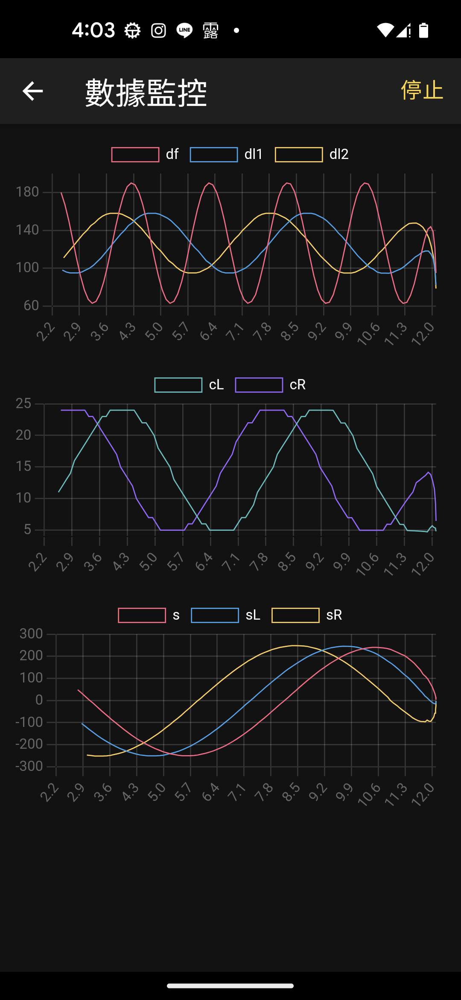

# Arduino Monitor Example
App 監控 Android 端範例程式

## 通訊協定及流程

Master (接收感測資料端, 主動連線端)  App
Slave (發送感測資料端, 被動連線端)    Arduino

1.	連線設定
雙方 Baud Rate均設定為 38400 bps
Json 封包，以 { 為起始，以 \n (LF)為結束

2.	起始封包

### M=>S Request
```json
{ "type":"start"}\n
```

### S=>M Response
```json
{
"type":"start-r",
"axis":[
	{"name":"df" , chart:0},
	{"name":"dr" , chart:0},
	{"name":"cL", chart:1},
	{"name":"cR", chart:1},
	{"name":"s", chart:2},
	{"name":"sL", chart:2},
	{"name":"sR", chart:2}
],
"dt": 100
}\n
```

### 說明:

#### 回覆 start 內容
```json
"type":"start-r"
```

#### axis 資料軸
##### cL 左輪計數
##### cR 右輪計數

```json
"axis":[
	{"name":"df" , chart:0},
	{"name":"dr" , chart:0},
	{"name":"cL", chart:1},
	{"name":"cR", chart:1},
	{"name":"s", chart:2},
	{"name":"sL", chart:2},
	{"name":"sR", chart:2}
],
```

dt: 取樣時間 (ms)

3.	內容封包

### S=>M Response
```json
{
"type":"data",
"data": {
	"df": 50,
	"dr": 40,
	"cL": 50,
	"cR": 40,
	"s": 160,
	"sL":160,
	"sR":160
 }
}
```


4.	結束封包

### M=>S Request
```json
{ "type":"stop"}
```

### S=>M Response
```json
{
"type":"stop-r"
}
```

### 回覆 stop 內容
```json
"type":"stop-r"
```


